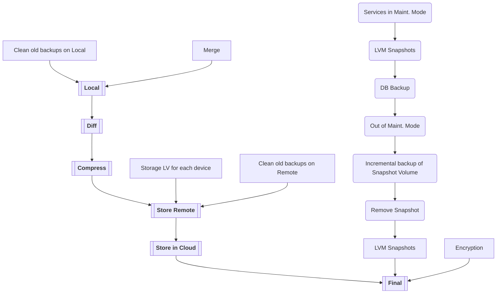

```mermaid
flowchart TD;
    %% To mark an item as completed (green)
    %% style EXAMPLE fill:#afa

    %% To provide a link
    %% A[<a href='https://google.com'>works</a>]

    FEAT_LOCAL_CLEAN[Clean old backups on Local] --> TARG_LOCAL
    FEAT_MERGE[Merge] --> TARG_LOCAL

    TARG_LOCAL[["`**Local**`"]] --> TARG_DIFF
    TARG_DIFF[["`**Diff**`"]] --> TARG_COMPRESS
    TARG_COMPRESS[["`**Compress**`"]] --> TARG_REMOTE

    FEAT_LV_EACH[Storage LV for each device] --> TARG_REMOTE
    FEAT_REMOTE_CLEAN[Clean old backups on Remote] --> TARG_REMOTE
    TARG_REMOTE[["`**Store Remote**`"]] --> TARG_CLOUD
    TARG_CLOUD[["`**Store in Cloud**`"]] --> TARG_FINAL
    TARG_FINAL[["`**Final**`"]]

    FUNC_MAINT(Services in Maint. Mode) -->
    FUNC_LVM_SNAP(LVM Snapshots) -->
    FUNC_DB_BAK(DB Backup) -->
    FUNC_UNMAINT(Out of Maint. Mode) -->
    FUNC_LVM_BAK(Incremental backup of Snapshot Volume) -->
    FUNC_UN_SNAP(Remove Snapshot) -->
    FEAT_LVM_SNAP[LVM Snapshots] --> TARG_FINAL

    FEAT_ENCRYPT[Encryption] --> TARG_FINAL
    
  
```
