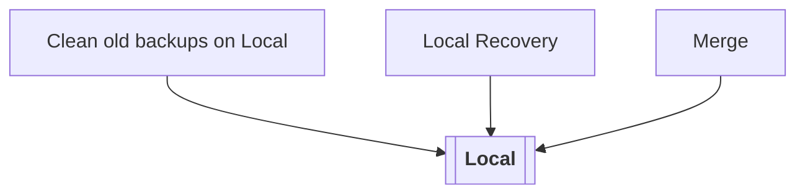
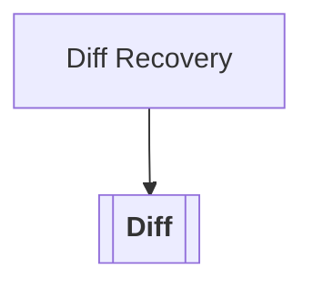
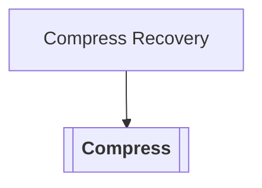
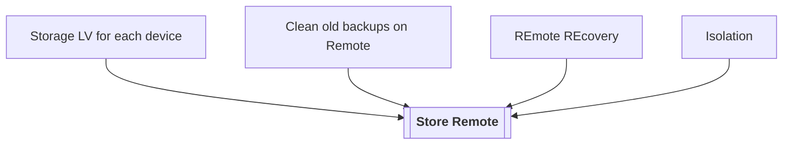
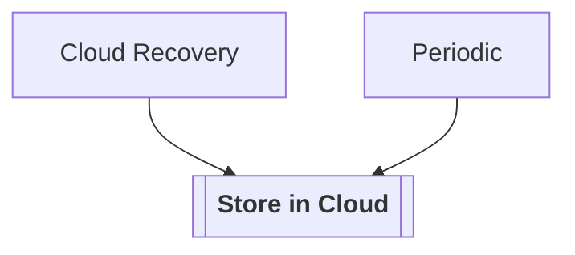
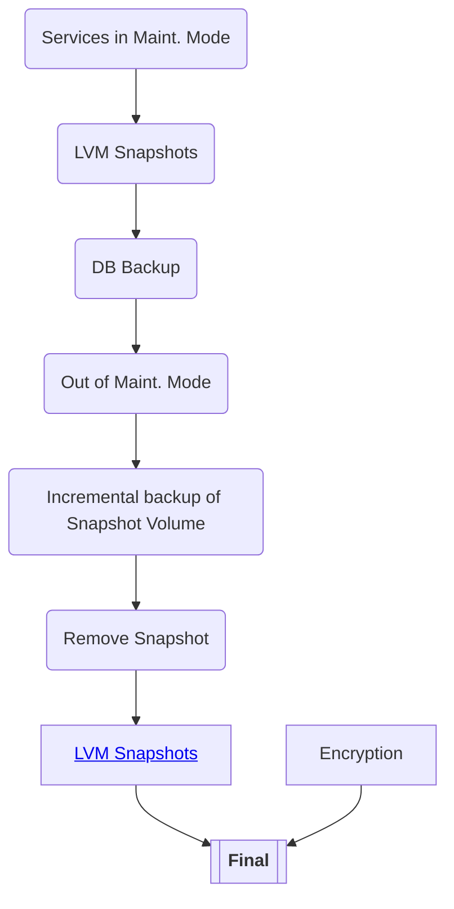

## Local
Local Backup. although not very likely to be commonly used (as backups should be stored somewhere else), it is something that is used in some circumstances.  It also is the first phase to test some initial functionality.

## Diff

## Compress

## Remote

## Cloud

## Final

